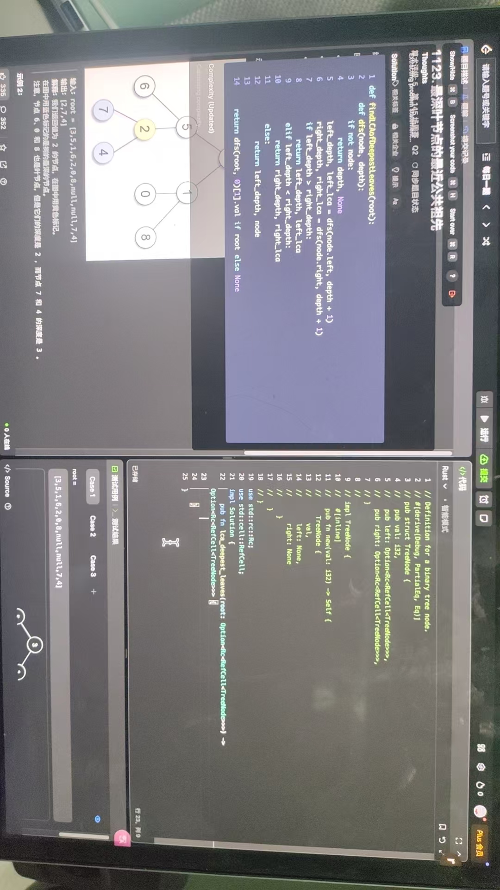

# Free Interview Coder

A desktop application to help with coding interviews.

## 说明

- 原项目[interview-coder](https://github.com/ibttf/interview-coder)付费，参考[free-interview-coder](https://github.com/Prat011/free-interview-coder)项目，但该项目只能使用 Gemini API，对其进行了修改，兼容 OpenAI API。

## 启动

### 本地开发

- 编辑`.env`文件，填写配置信息。参考[.env.example](.env.example)

依次执行：

```
npm install
npm run dev -- --port 5180
NODE_ENV=development npm run electron:dev
```

## 使用

- Press Cmd + Q (Mac) or Ctrl + Q (Windows/Linux) to quit
- Or use Activity Monitor/Task Manager to close Interview Coder
- The X button currently doesn't work (known issue)

## 演示


